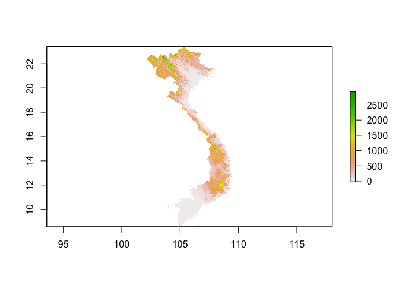

<!-- README.md is generated from README.Rmd. Please edit that file -->

# srtmVN

<!-- badges: start -->

[](https://ci.appveyor.com/project/epix-project/srtmVN)
<!-- badges: end -->

## Installation and loading

You can install `srtmVN` from
[Bitbucket](https://bitbucket.org/choisy/srtmVN)

``` r
# install.packages("devtools")
devtools::install_bitbucket("choisy/srtmVN", build_vignettes = TRUE)
```

Once installed, you can load the package:

``` r
library(srtmVN)
```

## Usage examples

The `RasterLayer` DEM from SRTM can be retrieved with the `getsrtm`
function:

``` r
srtm <- getsrtm()
#> SRTM data are not on disk.
#> Do you want to download them from the internet (108.0 MB)? y (default) / n
#> Loading required package: raster
#> Loading required package: sp
```

It’s a `RasterLayer` object:

``` r
srtm
#> class      : RasterLayer 
#> dimensions : 17796, 8790, 156426840  (nrow, ncol, ncell)
#> resolution : 0.0008333333, 0.0008333333  (x, y)
#> extent     : 102.1446, 109.4696, 8.562917, 23.39292  (xmin, xmax, ymin, ymax)
#> crs        : +proj=longlat +datum=WGS84 +no_defs +ellps=WGS84 +towgs84=0,0,0 
#> source     : /Library/Frameworks/R.framework/Versions/3.6/Resources/library/srtmVN/extdata/srtm90.tif 
#> names      : srtm90 
#> values     : -129, 3106  (min, max)
```

that can be plotted with the `plot` method:

``` r
plot(srtm)
```


